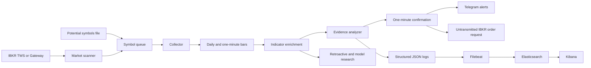

# Trading System

An experimental, event-driven trading research system for scanning US equities, collecting market data from Interactive Brokers, evaluating momentum and breakout conditions, confirming entries on one-minute data, and sending alerts.

The primary application starts in [`main.py`](main.py). The repository also contains tools for retroactive analysis, feature engineering, model training, Fixed Range Volume Profile research, and trade-performance reporting.

> [!WARNING]
> This project is research software, not financial advice. Use an Interactive Brokers paper account while developing or evaluating it. Review all order-handling code and broker settings before connecting any funded account.

## What the system does

- Connects to Trader Workstation or IB Gateway through the Interactive Brokers API.
- Scans US stocks for high relative movement using configurable broker-side filters.
- Collects daily and one-minute historical data, then keeps the one-minute stream updated.
- Enriches bars with indicators and market context including VWAP, moving averages, MACD, volume averages, pre-market activity, and resistance levels.
- Evaluates ten modular evidence cases for momentum, continuation, retracement, and breakout behavior.
- Confirms candidate entries with one-minute support-to-resistance patterns.
- Sends confirmation alerts through Telegram.
- Writes structured JSON logs that can be shipped to Elasticsearch and inspected in Kibana.
- Includes offline data preparation, Random Forest training, chart generation, FRVP research, and a local trade-performance dashboard.

## Main application flow



When `main.py` runs, it:

1. Loads configuration from `.env`.
2. Seeds a thread-safe symbol queue from the configured potential-symbols file.
3. Connects to IBKR on `localhost:8081` with client ID `0`.
4. Starts the IBKR scanner and requests daily and one-minute data for each symbol.
5. Runs collection, analysis, and confirmation workers concurrently.
6. Sends Telegram alerts for confirmed setups.
7. Creates an IBKR market-order request with `transmit=False` after the first confirmation for a symbol.

The scanner currently looks for top percentage gainers and applies filters for price, volume, market capitalization, shares outstanding, and percentage change. See [`tws/scanner.py`](tws/scanner.py) for the active thresholds.

## Repository structure

| Path | Purpose |
| --- | --- |
| `main.py` | Primary entry point and worker orchestration |
| `tws/` | IBKR client, scanner, data callbacks, and order helpers |
| `collector/` | Daily and one-minute data requests |
| `common/` | Shared market-data objects, calculations, and state |
| `analyzer/` | Resistance analysis and modular evidence cases |
| `buying_confirmator/` | One-minute support/resistance confirmation patterns |
| `alerter/` | Telegram alert formatting and delivery |
| `logger/` | Console and structured JSON logging |
| `model/` | Feature extraction, research, model training, and serialized models |
| `scripts/dashboard.py` | Local trade calendar and performance dashboard |
| `scripts/ibkr_flex.py` | Interactive Brokers Flex report synchronization |
| `scripts/stock_finder.py` | NASDAQ and Yahoo Finance research utility |
| `scripts/frvp_new_indicator.pine` | TradingView Pine Script companion indicator |

## Prerequisites

- Python 3.13 is recommended because it matches the supplied Docker image.
- Trader Workstation or IB Gateway with API access enabled on `localhost:8081`.
- An Interactive Brokers paper-trading account for development.
- Telegram bot credentials if alert delivery is required.
- Docker and Docker Compose only if using the optional logging stack.

## Local setup

Create and activate a virtual environment from the repository root:

```bash
python3.13 -m venv .venv
source .venv/bin/activate
python -m pip install --upgrade pip
python -m pip install -r requirements.txt
```

The IBKR integration, model utilities, and charting tools use these additional runtime packages:

```bash
python -m pip install ibapi python-dotenv requests elasticsearch numpy scikit-learn joblib plotly
```

Create the local runtime files:

```bash
mkdir -p logs
touch potential_symbols.txt
```

## Configuration

Create a `.env` file in the repository root. The file is ignored by Git.

```dotenv
TELEGRAM_BOT_TOKEN=replace_with_your_bot_token
TELEGRAM_CHAT_ID=replace_with_your_chat_id
TELEGRAM_ENABLED=true
POTENTIAL_SYMBOLS_FILE=./potential_symbols.txt
```

The potential-symbols file accepts one symbol and ISO timestamp per line:

```text
SYMBOL--2026-09-30T09:30:00
```

Entries older than 20 days are removed when the application starts. The IBKR scanner can also add symbols while the application is running.

## Run the primary application

Start Trader Workstation or IB Gateway first, log in to a paper account, and confirm that API connections are accepted on port `8081`. Then run:

```bash
python main.py
```

The application starts long-running collection, analysis, confirmation, logging, and IBKR event-loop threads. Stop it with `Ctrl+C`.

### Order safety

The confirmation path calls `place_buy_order` with `transmit=False`. That setting is an important safeguard, but it is not a substitute for reviewing the IBKR configuration and order code. Keep the application connected to a paper account until its behavior has been independently validated.

## Optional observability stack

The included Compose configuration provides Elasticsearch, Kibana, and Filebeat. Start only those services with:

```bash
docker compose up -d elasticsearch kibana filebeat
```

- Elasticsearch: `http://localhost:9200`
- Kibana: `http://localhost:5601`
- Application logs: `logs/app.log`

Filebeat reads the structured JSON log and writes daily `day_trading-*` indices to Elasticsearch.

## Trade-performance dashboard

[`scripts/dashboard.py`](scripts/dashboard.py) runs a local dashboard for IBKR trade exports. It provides calendar views, realized P&L summaries, time-of-day analysis, symbol statistics, and optional Yahoo Finance metadata.

Validate a CSV without starting the server:

```bash
python scripts/dashboard.py --file /path/to/trades.csv --check
```

Start the dashboard:

```bash
python scripts/dashboard.py --file /path/to/trades.csv
```

The default address is `http://127.0.0.1:8765`.

Export a self-contained HTML snapshot:

```bash
python scripts/dashboard.py --file /path/to/trades.csv --export-html report.html
```

### Optional IBKR Flex synchronization

The dashboard can download Activity and Trade Confirmation reports through the IBKR Flex Web Service. Create `scripts/ibkr_flex.env` with the values you use:

```dotenv
IBKR_FLEX_TOKEN=replace_with_your_flex_token
IBKR_ACTIVITY_QUERY_ID=replace_with_your_activity_query_id
IBKR_TRADE_QUERY_ID=replace_with_your_trade_query_id
IBKR_TRADE_SYNC_MINUTES=15
IBKR_ACTIVITY_SYNC_HOUR=3
IBKR_REQUEST_TIMEOUT_SECONDS=30
```

The file is covered by the repository's `*.env` ignore rule.

## Research and model pipeline

The `model/` package contains experimental tooling for:

- Extracting market-structure, volume, momentum, and pre-market features.
- Preparing positive and false-positive training datasets.
- Training a Random Forest classifier with repeated stratified cross-validation.
- Selecting decision thresholds and saving model, imputer, and feature bundles.
- Applying rule-based filters alongside model scores.
- Generating Plotly charts and approximate Fixed Range Volume Profiles from one-minute OHLCV data.
- Running breakout and movement-profile research.

Prepare the training CSV files from the existing serialized samples:

```bash
python -m model.training.prepare_data_for_train
```

Train and export the model artifacts:

```bash
python -m model.training.train_model
```

These workflows assume that the expected research datasets already exist under `model/training/` and that commands are run from the repository root.

## Data and generated artifacts

The repository currently contains serialized training samples, generated chart files, CSV research outputs, and trained model artifacts. Before publishing or cloning the project broadly, consider moving large generated files to Git LFS, release assets, or a separate data repository. Do not unpickle artifacts from untrusted sources.

## Development status

This is an active personal research project. The primary runtime and several research scripts use repository-relative paths and local service assumptions, so commands should be run from the repository root. Docker Compose is currently used for the observability services; the primary application is launched locally with `python main.py`.
